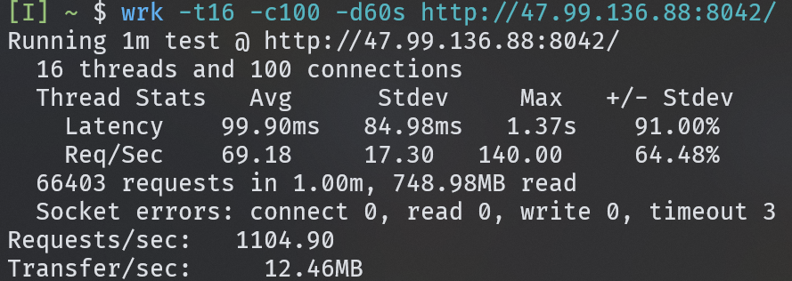

# PGS: C++ HTTP Static File Server

PGS (Pp3ng's Server) is a C++-based, multi-threaded HTTP static file server designed for efficient performance. It uses epoll for I/O multiplexing and a thread pool for handling requests concurrently. PGS supports features like MIME type detection, directory indexing, and JSON-based configuration. It's lightweight design and focus on simplicity.

## Architecture Overview

The server is built with a modular architecture, separating concerns into distinct classes for better maintainability and extensibility.


---

## How it works


## Benchmarking in a 2G RAM, 2 Core CPU server



---

## Features

- ✨ Multi-threaded request handling
- 📁 Static file serving
- ⚡ Epoll-based I/O multiplexing
- 🗜️ Gzip compression support
- 🔧 JSON-based configuration
- 🎯 MIME type detection
- 📡 A default nice 404 page
- 🚀 Thread pool for efficient concurrency
- 🛡️ Rate limiting middleware
- 📝 Robust error handling
- 🛠️ Easy to configure and deploy
- 📜 Detailed logging and error reporting
- 🔄 Keep-alive connection support

---

### Core Components

1. **Server**: The main orchestrator that initializes and coordinates all components.
2. **Socket**: Handles low-level network operations.
3. **Router**: Manages request routing and static file serving.
4. **ThreadPool**: Manages worker threads for concurrent request processing.
5. **Logger**: Thread-safe singleton logger for output formatting and logging.
6. **EpollWrapper**: Wrapper for epoll-based I/O multiplexing.
7. **Middleware**: Abstract class for request/response middleware.

   - **CompressionMiddleware**: Gzip compression middleware.
   - **RateLimitMiddleware**: Rate limiting middleware by Token Bucket algorithm.

8. **Cache**: LRU cache for storing static file contents.

### Utility Components

1. **Http**: Static utility class for HTTP protocol operations.
2. **Parser**: Configuration file parser using nlohmann/json.
3. **Config**: Structure for storing server configuration.
4. **TerminalUtils**: Utility for formatting terminal output.

## Prerequisites

- C++20 compiler
- nlohmann/json library
- Linux environment (uses epoll)

## Installation

```bash
# Clone the repository
git clone https://github.com/Pp3ng/pgs.git

# Create build directory
cd pgs
make
```

## Configuration

Create a `config.json` file in the server's root directory:

```json
{
  "port": 9527,
  "static_folder": "path/to/static",
  "thread_count": 4,
  "rate_limit": {
    "max_requests": 1000,
    "time_window": 60
  },
  "cache": {
    "size_mb": 512,
    "max_age_seconds": 3600
  }
}
```

### Configuration Parameters

- `port`: Server listening port
- `static_folder`: Directory containing static files to serve
- `thread_count`: Number of worker threads in thread pool
- `rate_limit`: Rate limiting configuration
  - `max_requests`: Maximum requests allowed in `time_window`
  - `time_window`: Time window in seconds for rate limiting
- `cache`: Cache configuration
  - `size_mb`: Maximum cache size in MB
  - `max_age_seconds`: Maximum cache age in seconds

## Usage

```bash
# Start the server
./pgs
```

The server will:

1. Log all actions to the console with colored output
2. Load configuration from pgs_conf.json
3. Initialize the thread pool
4. Start listening on the configured port
5. Serve static files from the configured directory

### sample


## Design Decisions

### ThreadPool Implementation

- Thread-safe queue for task management
- Condition variables for thread synchronization
- Graceful shutdown support

### Socket Handling

- Non-blocking sockets with epoll for I/O multiplexing
- SO_REUSEADDR option enabled
- IPv6 support (dual-stack)

### Router Features

- Automatic MIME type detection
- Directory index support
- 404 handling for non-existent files

### Supported MIME Types

- HTML (.html)
- CSS (.css)
- JavaScript (.js)
- Images (.png, .jpg, .jpeg, .gif)
- Plain text (default)

## Error Handling

- Socket creation and binding failures
- Configuration file parsing errors
- File read/write errors
- Invalid request handling
- Epoll operation errors

## Performance Considerations

1. **Epoll Usage**

   - Event-driven I/O for better scalability
   - Efficient handling of multiple connections

2. **Thread Pool**

   - Prevents thread explosion
   - Reuses threads for better performance
   - Configurable thread count

3. **Static File Serving**

   - Efficient file reading (binary and text)
   - MIME type detection
   - Directory traversal prevention
   - Compression support
   - Zero-copy file transfer (sendfile())

4. **Rate Limiting**

   - Prevents DDoS attacks
   - Configurable rate limits
   - Time window-based request tracking

5. **Cache Mechanism**

   - Reduces disk I/O
   - Configurable cache size and age
   - LRU cache eviction policy

### Response Codes

- 200 OK
- 304 Not Modified
- 400 Bad Request
- 401 Unauthorized
- 403 Forbidden
- 404 Not Found
- 405 Method Not Allowed
- 429 Too Many Requests
- 500 Internal Server Error
- 503 Service Unavailable

## Safety and Security

- Directory traversal prevention
- Robust error handling
- Resource cleanup on shutdown
- Graceful shutdown support
- Rate limiting middleware

## Known Limitations

1. Only supports GET requests
2. No SSL/TLS support
3. Limited to static file serving
4. Linux-specific (uses epoll)

## Future Improvements

- [ ] Add SSL/TLS support
- [x] Implement caching mechanisms
- [ ] Add support for dynamic content
- [ ] Cross-platform compatibility
- [ ] Configuration hot-reloading
- [ ] Better error reporting and logging
- [ ] Performance metrics and monitoring
- [ ] HTTP/2 support
- [ ] WebSocket support
- [x] Rate limiting and DDoS protection
- [x] Cache control and freshness headers
- [x] Gzip compression middleware
- [x] Directory indexing support
- [x] MIME type detection
